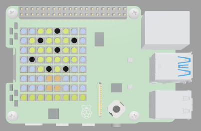
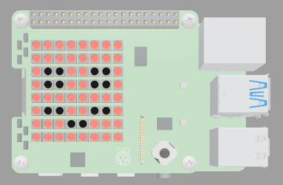

## Reflection

Well done, you have created some ambient artwork! Now it's time to reflect - reflecting is an important part of learning because it helps make new connections in your brain.

Answer the three questions below to reflect on what you've learned.

After each question, press 'Check my answer'. You will be guided towards the correct answer. You can do this activity as many times as you want to.

Have fun!

--- question ---

---
legend: Question 1 of 3
---

Below is a **list** that stores the colour values for displaying an image on the LED matrix of the SenseHAT. Look at the list and work out which image it will display.

--- code ---
---
language: python
filename: main.py
line_numbers: false
line_number_start: 
line_highlights: 
---
frame_1 = [
   c, c, c, c, c, c, c, c,
   c, c, c, c, c, c, c, c,
   c, b, b, c, c, b, b, c,
   c, b, b, c, c, b, b, c,
   c, c, c, c, c, c, c, c,
   c, b, b, c, c, b, b, c,
   c, c, c, b, b, c, c, c,
   c, c, c, c, c, c, c, c
  ]
--- /code ---

--- choices ---

- ( ) 

  --- feedback ---

Try again. There is a lot of detail in this image and it uses four colours. The list above only uses two different colour variables. 

  --- /feedback ---

- (x) 

  --- feedback ---

Excellent! You got it! The list above creates an image of a smiley face. 

  --- /feedback ---

--- /choices ---

--- /question ---
