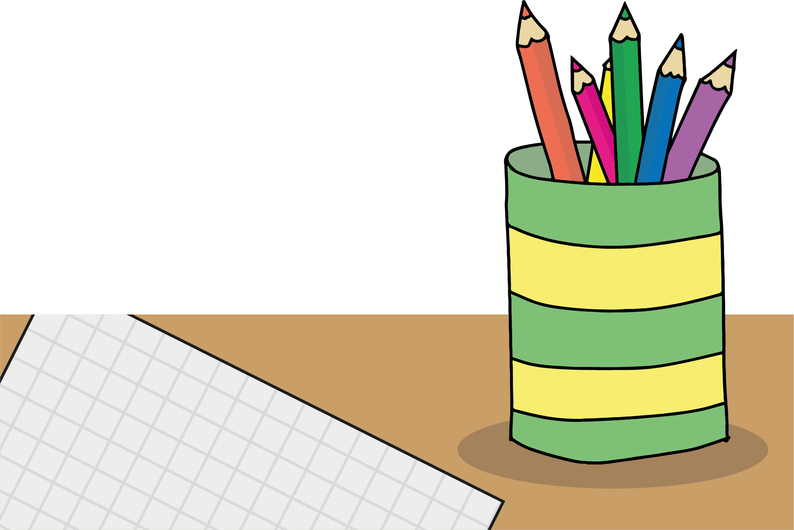
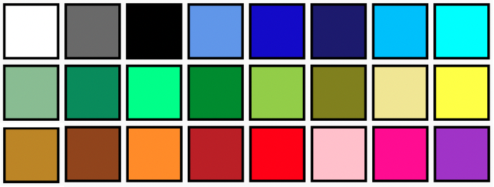
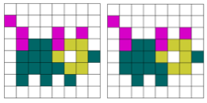
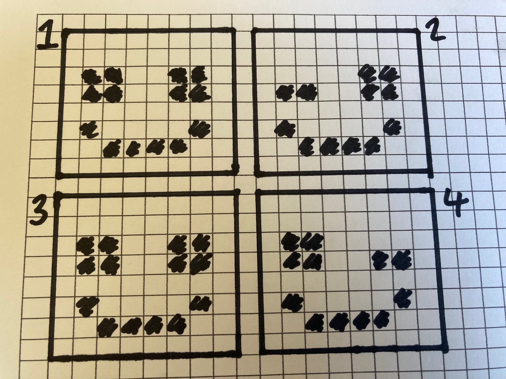

## Design your animation

Choose your colour palette and design your animation.

{:width="300px"}

--- task ---

What will be the theme of your animation? It could be: 
+ 🌈 **Weather:** A glowing rainbow, falling rain
+ 🐯 **Animals:** A swimming fish, a walking tiger
+ 🌿 **Nature:** A growing plant, a crashing wave
+ 🚀 **Travel:** A spinning earth, a soaring rocket
+ ⚾ **Sport:** A flying ball, a swimming athlete
+ 🎨 **Art:** A brush painting, paint splatter growing
+ 🎢 **Adventure:** A roller coaster, a treasure map 
+ Or something else

--- /task ---

--- task ---

**Choose** your colour palette.

Your animation should have at least two colours. Decide which colours your design will use.

--- /task ---

--- task ---

Design your animation frames.

**Tip:** Start with a maximum of four frames for your animation. You can always add more later.

[[[design-template]]]

--- collapse ---
---
title: Design using squared or plain paper
---

If you don't have access to a printer then you can use squared (graph) paper or plain paper to create your design.

+ For each frame, draw an 8 x 8 grid on your paper.

{:width="300px"}

+ Select a minimum of two coloured pencils or felt tip pens to colour in your frames. 

**Tip**: Make sure that you use colours from the colour palette!

--- /collapse ---

--- /task ---

--- save ---
