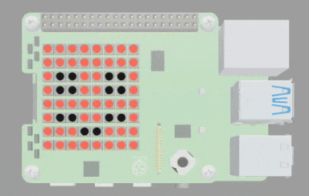
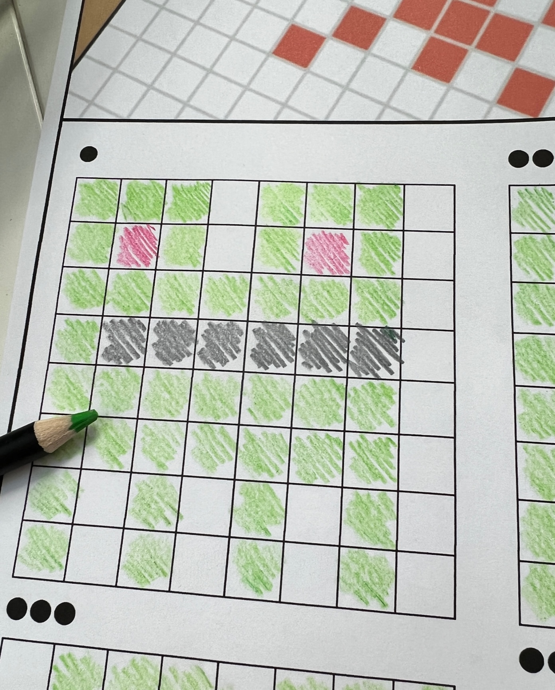
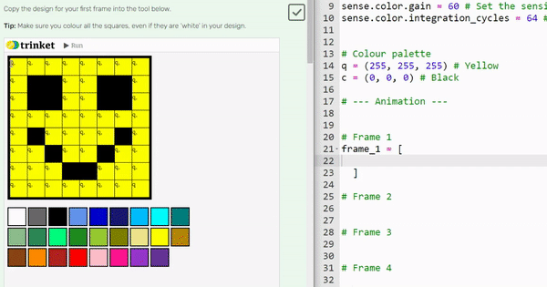
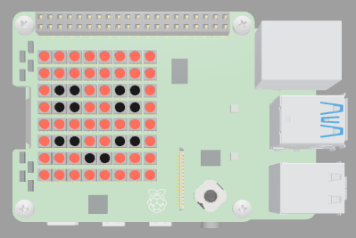

## Code your animation

Set up the frames for your animation and check that you are happy with it through testing.  

{:width="300px"}

--- task ---

Open the [ambient art starter project](https://trinket.io/library/trinkets/4e77300dfc){:target="_blank"}.

--- /task ---

### Colour palette

--- task ---

Find the comment `# Colour palette` and add variables for each of the colours you have chosen for your animation: 

{:width="300px"}

--- code ---
---
language: python
filename: main.py
line_numbers: false
line_number_start: 1
line_highlights: 2-5
---
# Colour palette
c = (0, 0, 0) # Black
a = (255, 255, 255) # White
v = (255, 0, 0) # Red
m = (34, 139, 34) # ForestGreen
--- /code ---

[[[ambient-colours]]]

[[[generic-theory-simple-colours]]]

--- /task ---

### Setup the function for your animation

--- task ---

Find the comment `# Animation based on the colour sensor`. 

Enter code to setup your animation function. Think of a sensible name to represent your animation. 

--- code ---
---
language: python
filename: main.py
line_numbers: false
line_number_start: 1
line_highlights: 2
---
# Animation based on the colour sensor
def fruit_fall():
--- /code ---

--- /task ---

### Frame 1

--- task ---

Copy the design for your first frame into the tool below by clicking on the colour in the colour palette and then on the square you want to colour. 

**Tip:** Make sure you colour all the squares, even if they are 'white' in your design. 

<iframe src="https://trinket.io/embed/html/d017077cff?outputOnly=true" width="100%" height="600" frameborder="0" marginwidth="0" marginheight="0" allowfullscreen></iframe>

--- /task ---

--- task ---

Find the comment `# Frame 1`.

**Create** a blank list to store your first frame.

Remember to **indent** your code inline with the `# Frame 1` comment so that it sits inside the function. 

--- code ---
---
language: python
filename: main.py
line_numbers: false
line_number_start: 1
line_highlights: 5-7
---
# Animation based on the colour sensor
def painting():
  
  # Frame 1
  frame_1 = [

  ]
--- /code ---

--- /task ---

--- task ---

**Highlight** the values in the frame creation tool above. 

**Copy** and **paste** them inside your blank list. 

Your code should like this this, with your own colour variables inside.

--- code ---
---
language: python
filename: main.py
line_numbers: false
line_number_start: 
line_highlights: 
---
# Frame 1
frame_1 = [
  b, b, l, l, f, l, b, b,
  b, l, f, l, l, l, f, b,
  b, l, l, l, f, l, l, b,
  b, f, l, l, l, l, l, b,
  b, b, l, f, l, f, b, b,
  b, b, b, t, t, b, b, b,
  b, b, b, t, t, b, b, b,
  g, g, g, g, g, g, g, g,
  ]
--- /code ---

**Tip**: To copy and paste you can highlight the text and then right click (tap and hold on mobile) and choose 'Copy'. Then click on the empty line inside the `frame_1` list, right click and choose 'Paste'.

**Tip**: If you are using Firefox then you will need to add in the line spaces to format your grid code.

--- /task ---

--- task ---

Underneath your `frame_1` list, enter the code for displaying your first frame on the SenseHAT LED matrix and make it `sleep` for 1 second.

--- code ---
---
language: python
filename: main.py
line_numbers: false
line_number_start: 1
line_highlights: 12-13
---
# Frame 1
frame_1 = [
  b, b, l, l, f, l, b, b,
  b, l, f, l, l, l, f, b,
  b, l, l, l, f, l, l, b,
  b, f, l, l, l, l, l, b,
  b, b, l, f, l, f, b, b,
  b, b, b, t, t, b, b, b,
  b, b, b, t, t, b, b, b,
  g, g, g, g, g, g, g, g,
  ]
sense.set_pixels(frame_1)
sleep(1) # Pause for 1 second
--- /code ---

--- /task ---

--- task ---

Find the comment `# Looped animation`.

Enter the function call for your animation function. Remember this has to match the name you used when creating your function. 

--- code ---
---
language: python
filename: main.py
line_numbers: true
line_number_start: 1
line_highlights: 2
---
# Looped animation 
painting()
--- /code ---

--- /task ---

--- task ---

**Test** your code by clicking Run.

You should see the first frame of your animation on the LED matrix. 

**Debug**:

I have a syntax error in my code!
+ Check that you have separated each variable with a comma in your list
+ Check that you code matches the examples given

--- /task ---

### Create the remaining frames

**Repeat** the next two tasks for the remaining frames. 

--- task ---

Use the tool below to make the remaining frames for your animation. 

**Tip**: You will need to overwrite the image for each new frame.

--- /task ---

<iframe src="https://trinket.io/embed/html/d017077cff?outputOnly=true" width="100%" height="600" frameborder="0" marginwidth="0" marginheight="0" allowfullscreen></iframe>

--- task ---

Find the comment for each frame and add code to display the frame on the LED matrix then pause `1` second.

--- code ---
---
language: python
filename: main.py
line_numbers: false
line_number_start: 1
line_highlights: 4-16
---
sense.set_pixels(frame_1) 
sleep(1)

# Frame 2
frame_2 = [
   b, b, l, l, l, l, b, b,
   b, l, l, l, f, l, l, b,
   b, l, f, l, l, l, l, b,
   b, l, l, l, f, l, f, b,
   b, f, l, l, l, l, b, b,
   b, b, b, f, t, f, b, b,
   b, b, b, t, t, b, b, b,
   g, g, g, g, g, g, g, g,
  ]
sense.set_pixels(frame_2) 
sleep(1)
--- /code ---

--- /task ---

--- task ---

**Test**: Run your code and make sure that you can view all four frames of your animation.

{:width="300px"}

**Debug**:

It isn't showing all of my frames!
+ Make sure that you have included the code for setting the pixels on the LED matrix
+ Make sure that you have used `sleep()` between each frame
+ Make sure that you have renamed each new frame. You should have four frames called `frame_1`, `frame_2`, `frame_3` and `frame_4`. 
+ Make sure that you have added code to display each frame within the brackets of `sense.set_pixels(frame_2)` 

--- /task ---

--- save ---
