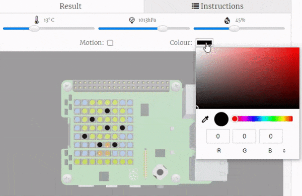
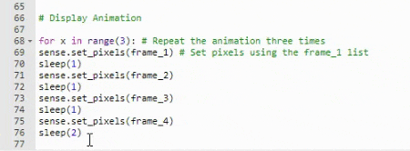

## Sense the colour

Sense the ambient colour of the environment and use this to adapt your animation. Use a `for` loop to repeat your animation.

{:width="300px"}

--- task ---

**Choose** Decide which of your colours you want to change to match the ambient colour. 

--- /task ---

--- task ---

**Find** the `# --- Animation ---` comment and add code to update your chosen ambient colour to the colour sensed by the SenseHAT colour sensor. 

--- code ---
---
language: python
filename: main.py
line_numbers: false
line_number_start: 
line_highlights: 2
---
# --- Animation ---
f = sense.colour.colour[0:3] # Store the sensor readings

# Frame 1
frame_1 = [
   b, b, l, l, f, l, b, b,
   b, l, f, l, l, l, f, b,
   b, l, l, l, f, l, l, b,
   b, f, l, l, l, l, l, b,
   b, b, l, f, l, f, b, b,
   b, b, b, t, t, b, b, b,
   b, b, b, t, t, b, b, b,
   g, g, g, g, g, g, g, g
   ]
 
--- /code ---

--- /task ---

--- task ---

**Test** Update the **Colour picker** tool on your SenseHAT emulator then run your code. Check that your animation uses the sensed colour. 

Change the **Colour picker** colour and run your project a couple of times to make sure the colour changes in your animation. 

**Debug**:
I have a syntax error!
+ Double check that your code matches the code in the example above

--- collapse ---
---
title: I'm running my code on a physical Sense HAT
---
You can alter the readings from the colour sensor by using coloured transparent plastic. Even using coloured felt tip pens on a small piece of [cling film](https://en.wikipedia.org/wiki/Plastic_wrap) will work.

--- /collapse ---

--- /task ---

A better way to change your animation to match the ambient colour is to loop your animation multiple times and check for a change in colour each run.

--- task ---

**Find** the `# --- Animation ---` comment and below add a line of code to loop your animation `10` times. 

--- code ---
---
language: python
filename: main.py
line_numbers: false
line_number_start: 1 
line_highlights: 2
---
# --- Animation ---
for i in range(10):
f = sense.colour.colour[0:3] # Store the sensor readings

# Frame 1
frame_1 = [
   b, b, l, l, f, l, b, b,
   b, l, f, l, l, l, f, b,
   b, l, l, l, f, l, l, b,
   b, f, l, l, l, l, l, b,
   b, b, l, f, l, f, b, b,
   b, b, b, t, t, b, b, b,
   b, b, b, t, t, b, b, b,
   g, g, g, g, g, g, g, g
   ]
 
--- /code ---

--- /task ---

--- task ---

You now need to indent your animation code so that it sits **inside** the `for` loop.

To do this, Use the **Tab** character on your keyboard before each line of code to indent them. 

--- code ---
---
language: python
filename: main.py
line_numbers: false
line_number_start: 1 
line_highlights: 2
---
# --- Animation ---
for i in range(10):
  f = sense.colour.colour[0:3] # Store the sensor readings

  # Frame 1
  frame_1 = [
    b, b, l, l, f, l, b, b,
    b, l, f, l, l, l, f, b,
    b, l, l, l, f, l, l, b,
    b, f, l, l, l, l, l, b,
    b, b, l, f, l, f, b, b,
    b, b, b, t, t, b, b, b,
    b, b, b, t, t, b, b, b,
    g, g, g, g, g, g, g, g
  ]
 
--- /code ---

--- collapse ---
---
title: Quickly indent a chunk of code
---

If you want to quickly indent a whole chunk of code then **highlight** it and then press the **tab** key on your keyboard. 

{:width="300px"}

--- /collapse ---

--- /task ---

--- task ---

**Test** Run your code and change the colour picker several times as your project is running. Check that your animation updates to use the sensed colour on it's next run of the animation. 

{:width="300px"}

**Debug**:
I have a syntax error!
+ Double check that your code matches the code in the example above
+ Make sure all the code to be repeated is indented  

--- /task ---

--- save ---