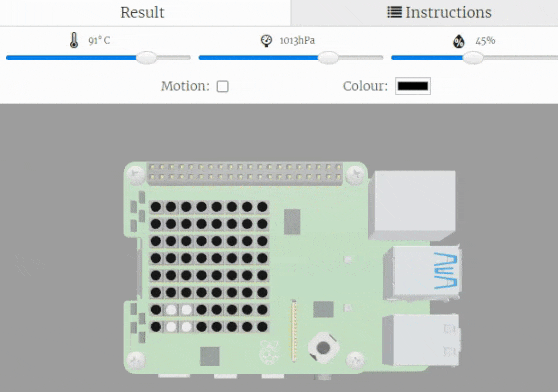

## What next?

If you are following the [Introduction to the SenseHAT](https://projects.raspberrypi.org/en/raspberrypi/sense-hat-intro) path, you can move on to the [XXXX](https://projects.raspberrypi.org/en/projects/monitor-this) project. In this project, you will make a tool that monitors the environment and produces text and an image to represent the sensed conditions.

--- no-print ---

<iframe src="https://trinket.io/embed/python/983ddf019a?outputOnly=true&runOption=run" width="600" height="500" frameborder="0" marginwidth="0" marginheight="0" allowfullscreen></iframe>

--- /no-print ---

--- print-only ---

--- /print-only ---